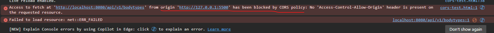
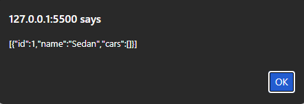

# 5. Set up CORS
## Step 1: Update SecurityConfig
Update ```SecurityConfig``` to set up CORS.
**config/SecurityConfig.java**
```java
package com.hieujavalo.spring_api.config;

import com.hieujavalo.spring_api.filter.JwtAuthenticationFilter;
import lombok.RequiredArgsConstructor;
import org.springframework.context.annotation.Bean;
import org.springframework.context.annotation.Configuration;
import org.springframework.http.HttpMethod;
import org.springframework.security.config.annotation.method.configuration.EnableMethodSecurity;
import org.springframework.security.config.annotation.web.builders.HttpSecurity;
import org.springframework.security.config.annotation.web.configuration.EnableWebSecurity;
import org.springframework.security.crypto.bcrypt.BCryptPasswordEncoder;
import org.springframework.security.crypto.password.PasswordEncoder;
import org.springframework.security.web.SecurityFilterChain;
import org.springframework.security.web.authentication.UsernamePasswordAuthenticationFilter;
import org.springframework.web.cors.CorsConfiguration;
import org.springframework.web.cors.CorsConfigurationSource;
import org.springframework.web.cors.UrlBasedCorsConfigurationSource;

import java.util.List;

@Configuration
@EnableWebSecurity
@RequiredArgsConstructor
@EnableMethodSecurity(prePostEnabled = true)
public class SecurityConfig {
    private final JwtAuthenticationFilter jwtAuthenticationFilter;
    private final JwtAuthenticationEntryPoint unauthorizedHandler;

    @Bean
    public PasswordEncoder passwordEncoder() {
        return new BCryptPasswordEncoder();
    }

    @Bean
    public CorsConfigurationSource corsConfigurationSource() {
        CorsConfiguration config = new CorsConfiguration();
        config.setAllowedOrigins(List.of("http://localhost:3000"));
        config.setAllowedMethods(List.of("GET","POST","PUT","DELETE","PATCH"));
        config.setAllowedHeaders(List.of("*"));
        config.setAllowCredentials(true);

        UrlBasedCorsConfigurationSource source = new UrlBasedCorsConfigurationSource();
        source.registerCorsConfiguration("/**", config);
        return source;
    }

    @Bean
    public SecurityFilterChain securityFilterChain(HttpSecurity http) throws Exception {
        http.csrf(csrf -> csrf.disable())
                .cors(cors -> cors.configurationSource(corsConfigurationSource()))
                .authorizeHttpRequests(auth -> auth
                        .requestMatchers("/api/v1/admin/**").hasRole("ADMIN")
                        .requestMatchers("/api/v1/auth/profile").authenticated()
                        .requestMatchers("/api/v1/auth/**").permitAll()
                        .requestMatchers(HttpMethod.GET, "/**").permitAll()
                        .anyRequest().authenticated()
                )
                .exceptionHandling(exceptions -> exceptions
                        .authenticationEntryPoint(unauthorizedHandler)
                )
                .addFilterBefore(jwtAuthenticationFilter, UsernamePasswordAuthenticationFilter.class);

        return http.build();
    }
}
```
## Step 2: Run application
Now open **SpringBootApiApplication.java** and click the triangle button to run.
## Step 3: Test if CORS has been correctly set up and is working
Open Visual Studio Code, create an HTML file as below.
```html
<!DOCTYPE html>
<html>
<body>
  <script>
    fetch("http://localhost:8080/api/v1/bodytypes")
      .then(r => r.text())
      .then(alert)
      .catch(err => alert("CORS error: " + err));
  </script>
</body>
</html>
```
And then start a live server on your browser. Open your browser, and you should see something like this:

That means CORS is working. The error is shown because the origin http://127.0.0.1:5500 isn't included in allowed origin list in our CORS configuration. To fix this, we may configure our CORS:

**config/SecurityConfig.java**
```java
CorsConfiguration config = new CorsConfiguration();
config.setAllowedOrigins(List.of("http://localhost:3000", "http://127.0.0.1:5500"));
config.setAllowedMethods(List.of("GET","POST","PUT","DELETE","PATCH"));
config.setAllowedHeaders(List.of("*"));
config.setAllowCredentials(true);
```
Then, rerun the application, refresh the browser, and we'll see data has been successfully fetched.

