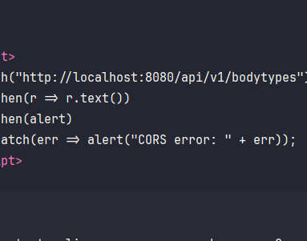
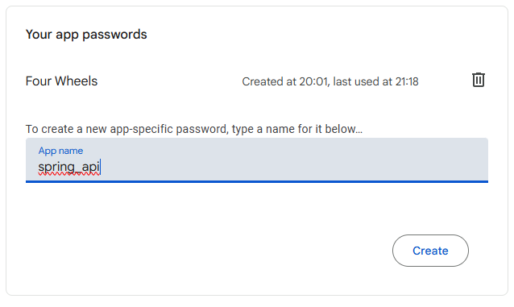

# 6. Verify Email with a verification code
## Step 1: Add dependency
Add the following dependency to **pom.xml** to send an email.
```xml
<dependency>
    <groupId>org.springframework.boot</groupId>
    <artifactId>spring-boot-starter-mail</artifactId>
</dependency>
```
Then reload your project
## Step 2: Get an app password from Google
To get an app password from Google, go to your Google Account, then search for "App Password".



Next, verify that it's you entering the "App passwords" page. Enter your app name, and then click "Create" button - Your app password will be generated.



Copy that app password because we'll need it for sending emails in our Spring application.
## Step 3: Update application.properties
Add the following properties to **application.properties** to handle email sending.
```properties
spring.mail.host=smtp.gmail.com
spring.mail.port=587
spring.mail.username=your-email@gmail.com
spring.mail.password=your-app-password
spring.mail.properties.mail.smtp.auth=true
spring.mail.properties.mail.smtp.starttls.enable=true
spring.mail.properties.mail.smtp.starttls.required=true
```
Replace ```your-email@gmail.com``` with your actual email, and ```your-app-password``` with the password you've got on step 2.
## Step 4: Update User entity
Add a new field for ```User``` with verification code.
**entity/User.java**
```java
package com.hieujavalo.spring_api.entity;

import com.hieujavalo.spring_api.enums.Role;
import jakarta.persistence.*;
import lombok.AllArgsConstructor;
import lombok.Data;
import lombok.NoArgsConstructor;

@Entity
@Table(name = "user")
@Data
@NoArgsConstructor
@AllArgsConstructor
public class User {
    @Id
    @GeneratedValue(strategy = GenerationType.IDENTITY)
    private Long id;

    @Column(unique = true, nullable = false)
    private String username;

    @Column(nullable = false)
    private String password;

    @Column(unique = true, nullable = false)
    private String email;

    @Column(nullable = false)
    @Enumerated(EnumType.STRING)
    private Role role;

    @Column
    private String verificationCode;

    @Column
    private Long verificationCodeGeneratedAt;

    @Column
    private boolean isEnabled = false; // default false
}
```
## Step 5: Create new DTOs
Create two new DTOs for code and email.
**dto/CodeRequest.java**
```java
package com.hieujavalo.spring_api.dto;

import jakarta.validation.constraints.NotBlank;
import lombok.AllArgsConstructor;
import lombok.Data;
import lombok.NoArgsConstructor;

@Data
@NoArgsConstructor
@AllArgsConstructor
public class CodeRequest {
    @NotBlank(message = "Code is required")
    private String code;
}
```
**dto/EmailRequest.java**
```java
package com.hieujavalo.spring_api.dto;

import jakarta.validation.constraints.NotBlank;
import lombok.AllArgsConstructor;
import lombok.Data;
import lombok.NoArgsConstructor;

@Data
@NoArgsConstructor
@AllArgsConstructor
public class EmailRequest {
    @NotBlank(message = "Email is required")
    private String email;
}
```
## Step 6: Update user repository
Update ```UserRepository``` to add two necessary methods for verification code.
**repository/UserRepository.java**
```java
package com.hieujavalo.spring_api.repository;

import com.hieujavalo.spring_api.entity.User;
import org.springframework.data.jpa.repository.JpaRepository;
import org.springframework.stereotype.Repository;

import java.util.Optional;

@Repository
public interface UserRepository extends JpaRepository<User, Long> {
    Optional<User> findByUsername(String username);
    Optional<User> findByEmail(String email);
    boolean existsByUsername(String username);
    boolean existsByEmail(String email);
    Optional<User> findByVerificationCode(String code);
}
```
## Step 7: Create new email service and update authentication service
Create ```EmailService``` to send email.
**service/EmailService.java**
```java
package com.hieujavalo.spring_api.service;

import jakarta.mail.internet.MimeMessage;
import lombok.RequiredArgsConstructor;
import lombok.extern.slf4j.Slf4j;
import org.springframework.mail.javamail.JavaMailSender;
import org.springframework.mail.javamail.MimeMessageHelper;
import org.springframework.stereotype.Service;

@Service
@Slf4j
@RequiredArgsConstructor
public class EmailService {
    private final JavaMailSender mailSender;

    public void sendEmail(String to, String subject, String body)  {
        try {
            MimeMessage message = mailSender.createMimeMessage();
            MimeMessageHelper helper = new MimeMessageHelper(message, true, "UTF-8");
            helper.setTo(to);
            helper.setSubject(subject);
            helper.setText(body, true); // true = HTML enabled
            mailSender.send(message);
        } catch (Exception e) {
            log.error("Failed to send email", e);
        }
    }
}
```
Update ```AuthService``` to send verification code via email on registration, and resend the code when needed.
**service/AuthService.java**
```java
package com.hieujavalo.spring_api.service;

import com.hieujavalo.spring_api.dto.AuthResponse;
import com.hieujavalo.spring_api.dto.LoginRequest;
import com.hieujavalo.spring_api.dto.RegisterRequest;
import com.hieujavalo.spring_api.entity.User;
import com.hieujavalo.spring_api.enums.Role;
import com.hieujavalo.spring_api.repository.UserRepository;
import com.hieujavalo.spring_api.util.JwtUtil;
import lombok.RequiredArgsConstructor;
import lombok.extern.slf4j.Slf4j;
import org.springframework.security.crypto.password.PasswordEncoder;
import org.springframework.stereotype.Service;

import java.util.Random;

@Service
@Slf4j
@RequiredArgsConstructor
public class AuthService {
    private final UserRepository userRepository;
    private final PasswordEncoder passwordEncoder;
    private final JwtUtil jwtUtil;
    private final EmailService emailService;
    private static final long CODE_EXPIRATION_MS = 10 * 60 * 1000; // 10 minutes

    public AuthResponse register(RegisterRequest request, boolean isAdmin) {
        if (userRepository.existsByUsername(request.getUsername())) {
            throw new IllegalArgumentException("Username already exists");
        }

        if (userRepository.existsByEmail(request.getEmail())) {
            throw new IllegalArgumentException("Email already exists");
        }

        User user = new User();
        user.setUsername(request.getUsername());
        user.setEmail(request.getEmail());
        user.setPassword(passwordEncoder.encode(request.getPassword()));
        user.setEnabled(false); // disable until confirmed

        // Generate 6-digit numeric verification code
        int code = new Random().nextInt(900000) + 100000;
        user.setVerificationCode(String.valueOf(code));

        if (isAdmin && request.getRole() != null) {
            user.setRole(request.getRole());
        } else {
            user.setRole(Role.CUSTOMER);
        }

        userRepository.save(user);

        // Send email
        String emailBody = "Thank you for registering into the system! " +
                "To continue, please use this code to verify your registration: <b>" +
                user.getVerificationCode() + "</b>.<br>Please take note that this code will expire in 10 minutes.";
        emailService.sendEmail(
                user.getEmail(),
                "Confirm your registration",
                emailBody
        );

        return new AuthResponse(null, request.getUsername(), user.getRole(),
                "Registration successful! Check your email to confirm.");
    }

    public AuthResponse login(LoginRequest request) {
        User user = userRepository.findByUsername(request.getUsername())
                .orElseThrow(() -> new IllegalArgumentException("Invalid credentials"));

        if (!user.isEnabled()) {
            throw new IllegalArgumentException("Email not confirmed yet");
        }

        if (!passwordEncoder.matches(request.getPassword(), user.getPassword())) {
            throw new IllegalArgumentException("Invalid credentials");
        }

        String token = jwtUtil.generateToken(user);
        return new AuthResponse(token, user.getUsername(), user.getRole(), "Login successful!");
    }

    public void confirmEmail(String code) {
        User user = userRepository.findByVerificationCode(code)
                .orElseThrow(() -> new IllegalArgumentException("Invalid confirmation code"));

        long now = System.currentTimeMillis();
        if (user.getVerificationCodeGeneratedAt() == null ||
                now - user.getVerificationCodeGeneratedAt() > CODE_EXPIRATION_MS) {
            throw new IllegalArgumentException("Verification code expired");
        }

        user.setEnabled(true);
        user.setVerificationCode(null);
        userRepository.save(user);
    }

    public void resendVerificationCode(String email) {
        User user = userRepository.findByEmail(email)
                .orElseThrow(() -> new IllegalArgumentException("Email not registered"));

        if (user.isEnabled()) {
            throw new IllegalArgumentException("Email already confirmed");
        }

        // Generate a new 6-digit code
        int code = new Random().nextInt(900000) + 100000;
        user.setVerificationCode(String.valueOf(code));
        user.setVerificationCodeGeneratedAt(System.currentTimeMillis());

        userRepository.save(user);

        // Send email
        String emailBody = "Your new verification code is: <b>" + user.getVerificationCode() +
                "</b>.<br>Please take note that this code will expire in 10 minutes.";
        emailService.sendEmail(
                user.getEmail(),
                "Resend verification code",
                emailBody
        );
    }
}
```
## Step 8: Update authentication controller
Finally, update the ```AuthController```.
**controller/AuthController.java**
```java
package com.hieujavalo.spring_api.controller;

import com.hieujavalo.spring_api.dto.*;
import com.hieujavalo.spring_api.entity.User;
import com.hieujavalo.spring_api.service.AuthService;
import jakarta.validation.Valid;
import lombok.RequiredArgsConstructor;
import lombok.extern.slf4j.Slf4j;
import org.springframework.http.ResponseEntity;
import org.springframework.security.access.prepost.PreAuthorize;
import org.springframework.security.core.annotation.AuthenticationPrincipal;
import org.springframework.web.bind.annotation.*;

@RestController
@RequestMapping("/api/v1/auth")
@Slf4j
@RequiredArgsConstructor
public class AuthController {
    private final AuthService authService;

    @PostMapping("/register")
    public ResponseEntity<AuthResponse> register(@Valid @RequestBody RegisterRequest request) {
        AuthResponse response = authService.register(request, false);
        return ResponseEntity.ok(response);
    }

    @PostMapping("/admin/register")
    @PreAuthorize("hasRole('ADMIN')")
    public ResponseEntity<AuthResponse> registerAdmin(@Valid @RequestBody RegisterRequest request) {
        AuthResponse response = authService.register(request, true);
        return ResponseEntity.ok(response);
    }

    @PostMapping("/confirm-code")
    public ResponseEntity<String> confirmEmailCode(@Valid @RequestBody CodeRequest request) {
        authService.confirmEmail(request.getCode());
        return ResponseEntity.ok("Email confirmed! You can now log in.");
    }

    @PostMapping("/resend-code")
    public ResponseEntity<String> resendCode(@Valid @RequestBody EmailRequest request) {
        authService.resendVerificationCode(request.getEmail());
        return ResponseEntity.ok("Verification code resent! Check your email.");
    }

    @PostMapping("/login")
    public ResponseEntity<AuthResponse> login(@Valid @RequestBody LoginRequest request) {
        AuthResponse response = authService.login(request);
        return ResponseEntity.ok(response);
    }

    @GetMapping("/profile")
    public ResponseEntity<ProfileResponse> getProfile(@AuthenticationPrincipal User user) {
        ProfileResponse response = new ProfileResponse(user.getUsername(), user.getEmail(), user.getRole());
        return ResponseEntity.ok(response);
    }
}
```
## Step 9: Run application
Now run your Spring application to test if it works.
